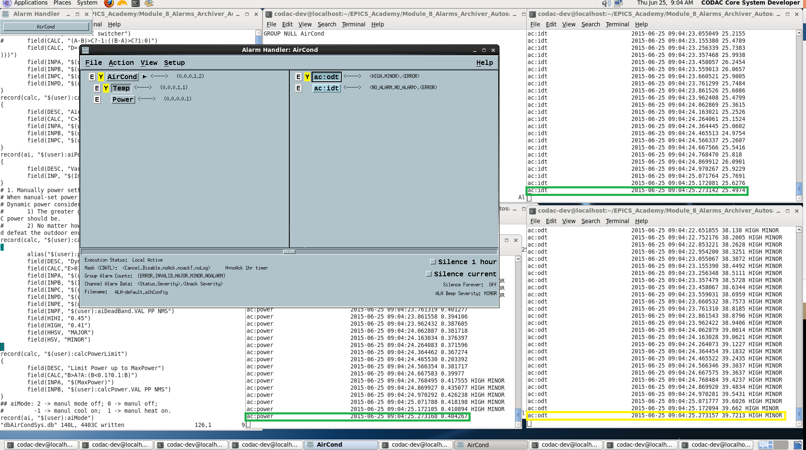
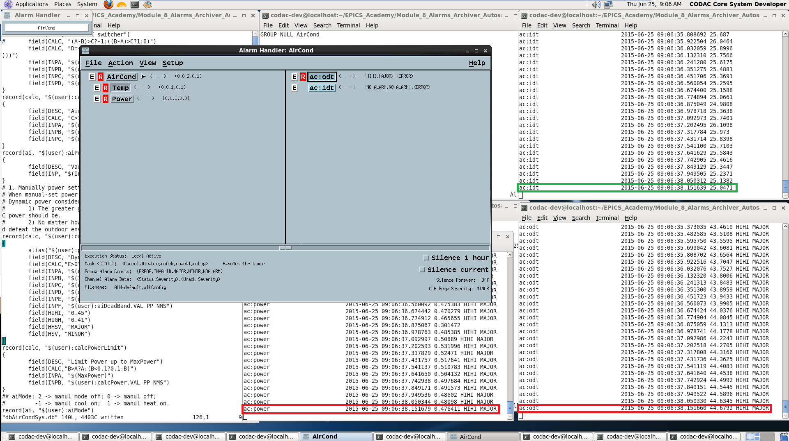

# Notes on ALH

## Installation Error

**Problem** in installing ALH:        
ALH has dependency on X11 and Motif.     
In the COSYLAB VM, the X11 and Motif are already installed.     
However, when installing the ALH by make, it warns that 'Xm.h is missing', which turns out:     
**openmotif-devel** is not installed!     

### Solution:

	yum install openmotif-devel.X86_64

## Set the *path* for ALH

	cp -l /opt/codac-4.1/epics/extensions/bin/linux-x86_64/alh /etc/alternatives/codac-usr-alh
	cp -l /etc/alternatives/codac-usr-alh /usr/bin/alh

## Instructions of ALH for Second Air Condition

### Goal
In the Doc of EPICS Academy, it asks to set alarms for the Second A/C indicating if the A/C power rises above 80% of maximum power      
or if the difference between the inside temperature and desired temperature exceeds *dT*. However, I set alarms for the A/C to detect       
1) whether the indoor/outdoor temperature is too high or too low or not;      
2) whether the A/C power is greater than the 80% of maximum power.     

In real alarm design, the temperature are divided into 5 sections by 0, 10, 30 and 40 degree,      
indicating *LOLO*, *LOW*, *NORMAL*, *HIGH* and *HIHI*, respectively.      
As for the A/C power, if it is greater than 0.41, the alarm goes off for *MINOR* severity;      
and if it is greater than 0.45, then the severity is *MAJOR*, for the maximum power is 0.5.     

### Setup
1. Compile and run the Sencond A/C IOC application. 
2. Turn the A/C into the auto mode and set the A/C power variable:

        caput ac:aiMode 2
        caput ac:aiPower 0

3. Create and configure the ALH configuration file 'ALH-default.alhConfig' for the A/C app, and start ALH.
4. Observe the records and the ALH status, and check whether it works.

### Result
The ALH works as shown in the following figures:

